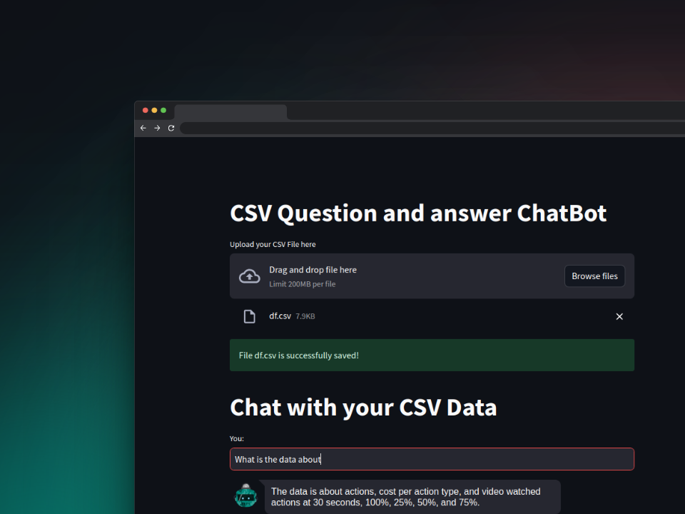

# Streamlit CSV Q&A Chatbot
[](LICENSE)
[](https://www.python.org/downloads/)
[](https://pypi.org/project/your-package-name/)
[](https://github.com/concaption/streamlit-langchain-csv-qna/graphs/contributors)
[](https://github.com/psf/black)
[](https://github.com/concaption/streamlit-langchain-csv-qna/issues)
[](https://github.com/concaption/streamlit-langchain-csv-qna/pulls)


## Overview

This is a chatbot application built using Streamlit and a series of NLP tools. The application allows users to upload a CSV file containing textual information. The chatbot can then respond to questions about the data stored in the uploaded CSV file.

## Todo
- [ ] Write a blog post on it.
- [ ] Refactor
- [ ] Re Write code such that it can be used a tutorial.
## Installation and Usage

### Prerequisites

- Python 3.6 or higher
- Git
- OpenAI API Key

### Clone the Repository

To clone the repository, run the following command in your terminal:

```bash
git clone https://github.com/concaption/streamlit-langchain-csv-qna.git
cd streamlit-langchain-csv-qna
```

### Create Virtual Environment

```bash
python -m venv .venv
source .venv/bin/activate
```

### API Key Setup

Create an OpenAI API key from [here](https://platform.openai.com/account/api-keys) and add it to `.streamlit/secrets.toml`:

```toml
open_ai_api_key = "your-api-key-here"
```

### Install Dependencies

Run the following command to install the necessary packages:

```bash
make install
```

### Linting and Formatting

To lint the code, run:

```bash
make lint
```

To format the code, run:

```bash
make format
```

### Testing

Run the following command to execute tests:

```bash
make test
```

### Running the App

To run the application, execute:

```bash
make run
```

## Features

- Upload a CSV file to query against
- Ask questions in natural language about the uploaded CSV data
- Uses OpenAI's GPT model to generate human-like responses
- Session storage for previous interactions
- Secure OpenAI API key storage via Streamlit secrets

## Workflow Commands

- `make install`: Install dependencies
- `make lint`: Lint the code
- `make format`: Format the code
- `make test`: Run the test suite
- `make run`: Run the application
- `make refactor`: Run lint and format
- `make all`: Perform install, lint, format, test, and run in one command

## Architecture

The architecture is fairly straightforward:

- `CSVLoader`: For loading and handling the CSV file.
- `VectorstoreIndexCreator`: For indexing the loaded documents.
- `RetrievalQA`: For retrieving answers from the indexed documents.
- `OpenAI`: For leveraging OpenAI's GPT model to generate natural language responses.

## License

This project is licensed under the MIT License - see the [LICENSE.md](LICENSE.md) file for details.

---

Made with :heart: by [Usama Navid](buildberg.co/about). For any issues or suggestions, open an issue.
